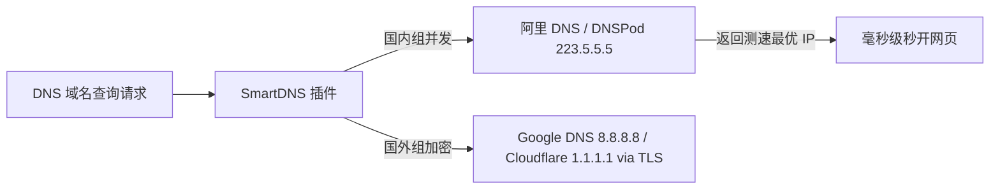

<ArticleHeader :likes="460" :views="8450" badge="软路由长文" category="🛠️ 软件教程" date="2026-08-28" id="mega-post-2" tags="OpenWrt软路由, OpenClash配置, PassWall 2, SmartDNS防污染, 旁路由网关, 全屋科学上网"/>

<!-- 懂哥机专属黑金 Banner -->
<div style="background: #0f172a; border-radius: 12px; padding: 2.2rem 1.5rem; text-align: center; margin-bottom: 2rem; border: 1px solid #334155; box-shadow: 0 4px 20px rgba(0,0,0,0.08);">
  <div style="font-size: 2.5rem; margin-bottom: 0.5rem;">⚙️</div>
  <div style="color: #ffffff; font-size: 1.65rem; font-weight: 900; letter-spacing: 1.5px;">2026 软路由全屋无感科学上网终极实战指南</div>
  <div style="color: #94a3b8; font-size: 0.92rem; margin-top: 0.6rem;">主旁路由拓扑 · OpenClash / PassWall 2 分流 · SmartDNS 防污染 · Apple TV / 游戏主机加速</div>
</div>

---

## 💡 前言：为什么要部署一台 OpenWrt 软路由？

如果你家里有 **Apple TV (看 Netflix 4K / Disney+)、PS5 / Xbox / Switch (游戏下载与联机加速)、Sony 智能电视或大量全屋智能家居设备**，你一定体会过在每台设备上逐个安装、配置客户端的繁琐。

通过部署一台 **OpenWrt 软路由**，你可以在网关层面统一托管全家所有设备的网络流量：
- **全屋设备无感科学上网**：手机、平板、电脑、电视开机即享受透明翻墙，无需安装任何客户端；
- **智能分流与防 DNS 污染**：国内流量直连秒开，国外流量自动走机场专线，DNS 零污染解析；
- **自动节点故障转移 (Failover)**：当某个节点超时，软路由可在 1 秒内无感切换至备用节点，保障连通性。

本文将手把手带你完成从**软路由硬件选型、主旁路由网络拓扑设计、OpenClash / PassWall 2 双内核配置到 SmartDNS 加速**的全流程构建。

---

## 🛠️ 第一章：2026 软路由硬件选型与系统方案

软路由的本质就是一台多网卡的微型 X86 / ARM 工控主机：

| 硬件架构 / 芯片 | 典型代表机型 | 网口与带宽支持 | 性能评估 | 推荐使用场景 |
| :--- | :--- | :--- | :--- | :--- |
| **Intel X86 架构** | N100 / N5105 / i7-13700K | 2.5G 双网口 / 4网口 | ⚡ 极其强悍，轻松跑满 2500M 流量 | 虚拟机 PVE / ESXi + 软路由 + NAS 全能服务器 |
| **ARM 架构** | 友善 NanoPi R4S / R5S | 千兆 / 2.5G 双网口 | 🌿 超低功耗 (5W-10W)，稳定性极佳 | 纯软路由旁路由专机 |
| **硬路由刷机** | 红米 AX6000 / 补充路由器 | 千兆网口 | 🪙 性价比高，但性能上限受限 | 预算受限的轻度家庭 |

---

## 🌐 第二章：主路由 vs 旁路由 (Gateway) 拓扑架构设计

为了避免影响家里不翻墙成员的正常上网，**旁路由模式（单网臂旁路网关）** 是目前最安全、维护成本最低的部署方案。

```mermaid
graph TD
    Modem[光猫 (桥接模式)] -->|PPPoE 拨号| MainRouter[主路由器 (IP: 192.168.1.1)]
    MainRouter -->|网线直连| SoftRouter[OpenWrt 旁路由 (IP: 192.168.1.2)]
    
    subgraph 全屋设备无感接入
        MainRouter -.->|普通上网设备 (网关 192.168.1.1)| PC[普通手机 / 家人电脑]
        MainRouter -.->|科学上网设备 (手动网关设置 192.168.1.2)| AppleTV[Apple TV / PS5 / 极客电脑]
    end

    SoftRouter -->|分流处理| MainRouter
```

### 2.1 旁路由关键网络参数配置
1. **主路由 IP**：`192.168.1.1`（开启 DHCP 服务，分配网关为 `192.168.1.1`）；
2. **OpenWrt 旁路由 IP**：`192.168.1.2`；
3. **旁路由接口设置**：
   - 静态 IP：`192.168.1.2`
   - 子网掩码：`255.255.255.0`
   - IPv4 网关：`192.168.1.1`（指向主路由）
   - 自定义 DNS 服务器：`192.168.1.1` 或 `223.5.5.5`
   - **必须勾选“忽略此接口”**（关闭旁路由自身的 DHCP 服务，防止网络冲突）。

---

## 🚀 第三章：OpenClash (Mihomo 内核) 从零到精通实战

OpenClash 是 OpenWrt 上功能最强大、规则支持最完善的科学上网插件。

```mermaid
graph LR
    Sub[机场订阅链接 / YAML] --> OpenClash[OpenClash 插件]
    OpenClash --> Core[Mihomo (Clash Meta) 核心]
    Core --> Rule[规则分流: GEOIP / GEOSITE]
    Rule -->|国内流量| Direct[直连 192.168.1.1]
    Rule -->|国外流量| Proxy[暮光加速 / 梯子云 IPLC 专线]
```

### 3.1 核心步骤一：安装与内核更新
1. 在 OpenWrt 管理界面打开 `服务` ➔ `OpenClash`；
2. 进入 `全局设置` ➔ `版本更新`，将 **Mihomo (Clash Meta)** 内核更新至最新稳定版；
3. 开启 `Meta 内核模式` 以支持 VLESS-Reality 与 Hysteria 2 节点协议。

### 3.2 核心步骤二：订阅导入与规则配置
1. 进入 `配置订阅` ➔ 点击 `添加`；
2. 填入你的**专线机场订阅链接**（建议优先选择 [暮光加速](https://tizi2.twilightaff.com/#/?code=nogJwChd) 或 [梯子云](https://tiziyun3.ladderaff.com/#/register?code=9otclbmc) 的 Clash 专属订阅）；
3. 勾选 `订阅转换`（如需要）并保存；
4. 点击 `一键更新订阅配置`。

### 3.3 核心步骤三：TUN 模式与 DNS 截获设置
- **运行模式**：选择 `TUN 模式`（TUN 模式可在系统网络层拦截全量流量，完美解决电视与游戏主机不走 HTTP 代理的问题）；
- **DNS 基础打造**：开启 `本地 DNS 截获`，选择 `Fake-IP 模式`，实现域名解析毫秒级返回。

---

## ⚡ 第四章：PassWall 2 智能多链路分流与自动切换

PassWall 2 以极其轻量、占用内存低、节点切换迅速著称，适合作为备用分流插件。

### 4.1 PassWall 2 的自动故障转移 (Failover) 配置
1. 进入 `PassWall` ➔ `节点订阅` ➔ 添加机场订阅；
2. 进入 `自动切换设置`：
   - 添加主用节点：`香港 01 | 专线`
   - 添加备用节点：`日本 01 | 专线` / `新加坡 01 | 专线`
   - 心跳检查间隔：`5 秒`
   - 连续失败次数阈值：`2 次`
3. 效果：当主专线发生短暂波动时，PassWall 自动在 10 秒内无痛切换至备用节点，网页无感。

---

## 🔒 第五章：SmartDNS 防污染与零延迟网页秒开

DNS 污染与解析延迟是导致网页打开慢、出现“连接不安全”的核心元凶。使用 **SmartDNS** 实现双路并发解析：



1. **国内组 (China Group)**：绑定 `223.5.5.5` 与 `119.29.29.29`，直连解析国内域名；
2. **国外组 (Overseas Group)**：绑定 `8.8.8.8` 与 `1.1.1.1` (DoT/DoH)，避免 DNS 抢答与污染；
3. **SmartDNS 测速优化**：开启 `测速模式 (ping, tcp:443)`，SmartDNS 将自动返回延迟最低的服务器 IP。

---

## 📺 第六章：Apple TV / 游戏主机全屋无感上网实战

### 6.1 Apple TV 4K 部署
1. 打开 Apple TV ➔ `设置` ➔ `网络` ➔ 选择你的 Wi-Fi 或有线连接；
2. 将 `配置 IP` 设为 `手动`；
3. 填写静态 IP：`192.168.1.150`；
4. **关键一步：将 `网关` 填写为旁路由 IP：`192.168.1.2`**；
5. 将 `DNS` 填写为 `192.168.1.2`；
6. 效果：打开 Netflix / Disney+ / YouTube，自动加载最高 4K Dolby Vision 画质！

### 6.2 PS5 / Xbox / Switch 游戏加速配置
- 很多主机游戏在进行联机或下载更新时丢包严重。将主机网关指向软路由后，在 OpenClash 中将主机 IP 划归至 **`UDP 游戏加速节点`**，NAT 类型直接提升至 **NAT 1 / Open**，加速下载与联机体验。

---

## 🏆 第七章：适合软路由全屋托管的推荐专线机场

软路由全屋托管对机场节点的**多并发连接数、IPLC 专线稳定性与 1.0x 计费**提出了极高要求：

<div class="custom-table-container">

| 排名 | 机场品牌 | 最低资费 / 优惠码 | 软路由适用性评价 | 快捷通道 |
| :---: | :--- | :--- | :--- | :---: |
| <span class="rank-badge r-1">TOP 1</span> | **暮光加速** | ¥20/月 (120G)<br><span class="code-pill">mm88</span> | 纯 IEPL 专线，全屋 4K 秒开，支持 OpenClash 一键导入 | <div class="table-btn-group"><a href="https://tizi2.twilightaff.com/#/?code=nogJwChd" target="_blank" rel="nofollow sponsored" class="t-btn-aff">官网 ↗</a><a href="/reviews/muguang" class="t-btn-rev">评测</a></div> |
| <span class="rank-badge r-2">TOP 2</span> | **梯子云** | ¥25/月 (125G)<br><span class="code-pill">tiziyun</span> | 全线企业专线，稳定性极强，适配全屋智能设备无感托管 | <div class="table-btn-group"><a href="https://tiziyun3.ladderaff.com/#/register?code=9otclbmc" target="_blank" rel="nofollow sponsored" class="t-btn-aff">官网 ↗</a><a href="/reviews/tiziyun" class="t-btn-rev">评测</a></div> |
| <span class="rank-badge r-3">TOP 3</span> | **FlyV** | ¥25/月 (150G)<br><span class="code-pill">fly20</span> | 不限制在线设备连接数，全节点 1.0x 计费，全屋大流量首选 | <div class="table-btn-group"><a href="https://tizi2.flyvaff.com/#/?code=JrLBx09H" target="_blank" rel="nofollow sponsored" class="t-btn-aff">官网 ↗</a><a href="/reviews/flyv" class="t-btn-rev">评测</a></div> |

</div>

---

## ❓ 第八章：常见软路由断网与排障 FAQ

#### Q1: 设置旁路由网关后，手机无法上网或出现网络环路怎么办？
> **懂哥机硬核解答**：这是最常见的配置错误。请检查：
> 1. 主路由与旁路由不能同时开启二次 NAT 转发；
> 2. 旁路由的 LAN 口必须关闭 DHCP 服务；
> 3. 在 OpenWrt 自定义防火墙规则中添加一条 iptables 规则：`iptables -t nat -A POSTROUTING -j MASQUERADE`。

#### Q2: OpenClash 的 Fake-IP 模式与 Redir-Host 模式怎么选？
> **懂哥机硬核解答**：推荐首选 **Fake-IP 模式**。Fake-IP 模式直接由软路由返回合成 IP，避免了本地 DNS 查询等待，网页秒开率提升 50% 以上。

---

<ArticleLikes :initial="460" id="mega-post-2" mode="bottom"/>
