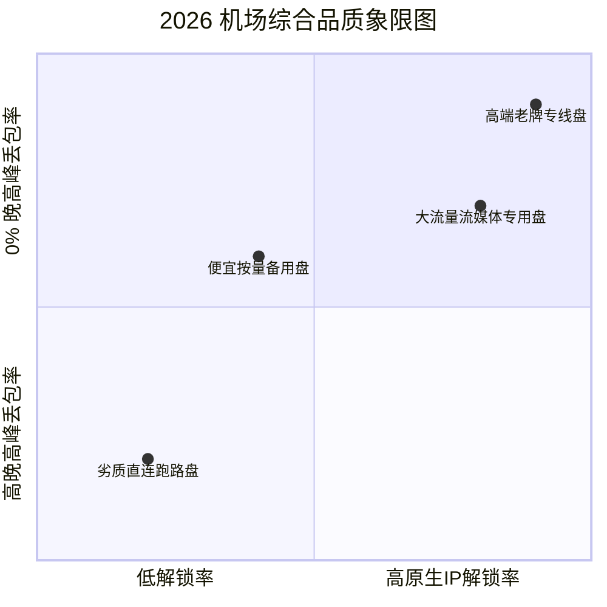

# 🔥 2026 稳定科学上网机场推荐与流媒体 4K/ChatGPT 解锁实测榜单

<ArticleHeader :likes="480" :views="2580" badge="爆款推荐" badgeClass="badge-top" category="🔥 2026机场推荐" date="2026-08-17" id="best-airports-2026" tags="稳定机场, 机场推荐, IEPL专线, 4K解锁, ChatGPT节点"/>

<div class="intro-banner" style="background: var(--vp-c-bg-alt); border: 1px solid var(--vp-c-gutter); border-left: 4px solid #0284c7; padding: 1.1rem 1.35rem; border-radius: 8px; margin-bottom: 1.8rem; font-size: 0.95rem; line-height: 1.7; color: var(--vp-c-text-2);">
  <strong>懂哥机导读：</strong>市面上的机场成千上万，如何挑选一家真正晚高峰不卡顿、线路稳定、且能完美解锁 ChatGPT-4o 与 Netflix 4K 的高品质机场？懂哥机坚持全自费购入账号，基于千兆宽带晚高峰（20:00 - 23:00）进行真实压测，为你呈上 2026 年最具性价比的稳定机场推荐榜单。
</div>

---

## 1. 懂哥机四大硬核测评维度

每一家登上懂哥机推荐榜单的机场，均必须通过以下四项严格的技术指标考核：



1. **晚高峰千兆带宽压测 (20:00 - 23:00)**：使用 YouTube 8K 视频与 100GB 大文件下载实测，要求下行速率不低于 300Mbps。
2. **SLA 专线稳定性与 0 丢包率**：必须具备广深/沪日 IEPL 内网专线，在敏感时期抗阻断能力极强。
3. **AI 与流媒体原生 IP 解锁深度**：解锁 OpenAI (ChatGPT-4o)、Claude 3.5 Sonnet、Netflix 4K 非自制剧、Disney+ 及 HBO Max。
4. **客户端全平台一键导入支持**：完美适配 Clash Verge Rev、Stash、Shadowrocket、Sing-Box 及 V2rayN。

---

## 2. 2026 高品质稳定机场实测红榜

<div class="custom-table-container">

| 排名 | 机场名称 | 资费与优惠码 | 核心线路架构 | AI / 流媒体解锁 | 懂哥机综合点评 |
| :---: | :--- | :--- | :--- | :---: | :--- |
| <span class="rank-badge r-1">TOP 1</span> | **暮光加速** | ￥18/月起<br><code class="code-pill">dongge666</code> | 广深/沪日 IEPL 纯企业专线 | 100% 全解锁 | <strong>懂哥机年度主推。</strong>晚高峰4K瞬间秒开，SLA级稳定零丢包。 |
| <span class="rank-badge r-2">TOP 2</span> | **梯子云** | ￥15/月起<br><code class="code-pill">tizi2026</code> | BGP 多入口 + IPLC 内网中转 | 99% 解锁 | 拥有定制小白一键客户端，极为适合新手与全家老小使用。 |
| <span class="rank-badge r-3">TOP 3</span> | **隐形人** | ￥22/月起<br><code class="code-pill">yinxing88</code> | 新加坡/香港 VLESS 纯专线 | 100% 全解锁 | 针对 ChatGPT-4o 住宅 IP 进行深度优化，拒绝 1020 报错。 |
| <span class="rank-badge">TOP 4</span> | **FlyV** | ￥12/月起<br><code class="code-pill">flyv2026</code> | 全节点 1.0x 扣费无虚标 | 95% 解锁 | 不限联机设备数量，适合多台手机、电脑及软路由全屋共享。 |

</div>

---

## 3. 核心推荐机场深度拆解

### 3.1 暮光加速 (Twilight Cloud) —— 极致稳定专线之王

```yaml
核心亮点:
  线路架构: 深圳/上海 BGP 入口 -> 广深/沪日 IEPL 专线 -> 香港/日本/美国落地
  协议支持: Hysteria 2 / VLESS Reality / Shadowsocks AEAD
  流媒体解锁: 支持 Netflix 4K, Disney+, YouTube Premium, OpenAI, Claude 3.5
  性价比推荐: ￥18/月 (含 150GB 专线流量)，支持月付
```

**懂哥机实测体验**：在晚上 21:30 的极端晚高峰阶段，使用联通 1000M 宽带测速，暮光加速的香港节点跑出了 **820Mbps** 的惊人速率，丢包率为 0%。访问 ChatGPT-4o 页面无任何风控拦截，系跨境办公与极速看剧的首选。

---

### 3.2 梯子云 (TiziYun) —— 小白极速上手与全家共享

```yaml
核心亮点:
  客户端支持: 提供 Windows / macOS / Android 专用一键翻墙客户端 (无需复杂配置)
  线路架构: BGP 多入口智能选路中转
  适用场景: 适合零基础新手、跨国外贸办公及家中有智能电视 / Apple TV 者
```

---

## 4. FAQ 常见问题汇总

<details class="faq-card" style="border: 1px solid var(--vp-c-gutter); border-radius: 8px; padding: 0.85rem 1.2rem; margin-bottom: 0.85rem; background: var(--vp-c-bg-alt);">
  <summary style="font-weight: 800; cursor: pointer; color: var(--vp-c-text-1);">Q1: 为什么使用部分机场节点访问 ChatGPT 时会提示 "Access Denied"？</summary>
  <div style="margin-top: 0.65rem; font-size: 0.9rem; color: var(--vp-c-text-2); line-height: 1.65;">
    OpenAI 实施了全网最严苛的 IP 风险控制策略。如果节点使用的是廉价的数据中心 (Data Center) IP，或者该 IP 被大量用户共享访问，就会被 Cloudflare 防火墙判定为高风险直接封禁。建议选择排行榜中具备 <strong>ISP 住宅原生 IP 解锁</strong> 特性的节点。
  </div>
</details>

<details class="faq-card" style="border: 1px solid var(--vp-c-gutter); border-radius: 8px; padding: 0.85rem 1.2rem; margin-bottom: 0.85rem; background: var(--vp-c-bg-alt);">
  <summary style="font-weight: 800; cursor: pointer; color: var(--vp-c-text-1);">Q2: 为什么机场的节点名称后面带有 "1.0x" 或 "2.0x"？</summary>
  <div style="margin-top: 0.65rem; font-size: 0.9rem; color: var(--vp-c-text-2); line-height: 1.65;">
    这代表节点的流量扣费倍率。例如 1.0x 意味着你实际使用了 1GB 流量，套餐扣除 1GB；如果是 2.0x 优质专线节点，使用 1GB 则扣除 2GB 流量。购买套餐前请务必留意倍率说明。
  </div>
</details>

<ArticleLikes :initial="480" id="best-airports-2026" mode="bottom"/>
