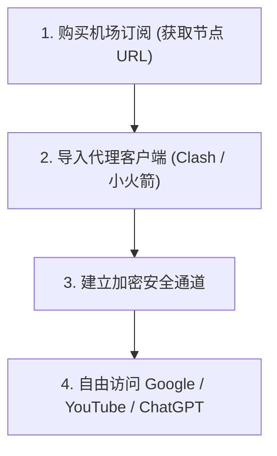

# 🛠️ 小白必看：从零开始如何挑选靠谱的机场？2026 科学上网新手避坑白皮书

<ArticleHeader :likes="320" :views="2100" badge="新手必读" badgeClass="badge-top" category="🛠️ 软件与教程中心" date="2026-08-17" id="newbie-airport-guide-2026" tags="新手教程, 机场怎么选, 科学上网入门, 订阅导入, 翻墙工具"/>

<div class="intro-banner" style="background: var(--vp-c-bg-alt); border: 1px solid var(--vp-c-gutter); border-left: 4px solid #0284c7; padding: 1.1rem 1.35rem; border-radius: 8px; margin-bottom: 1.8rem; font-size: 0.95rem; line-height: 1.7; color: var(--vp-c-text-2);">
  <strong>懂哥机导读：</strong>对于刚刚接触科学上网的新手来说，“VPN”、“机场”、“Shadowsocks”、“订阅链接”等专业术语往往让人头大。不少小白因为缺乏基础常识，误下载了恶意的圈钱 VPN 或被跑路机场骗取年付资金。本白皮书为你提供从零开始的保姆级入坑全指南。
</div>

---

## 1. 核心概念科普：什么是“机场”与“代理客户端”？

简单来说，科学上网由 **“车辆 (代理客户端软件)”** 与 **“高速公路 (机场节点服务)”** 两部分组成：



- **代理客户端（软件）**：相当于运行在手机或电脑上的播放器。例如 Windows 上的 **Clash Verge Rev**，iOS 上的 **Shadowrocket (小火箭)**，Android 上的 **Flclash / V2rayN**。
- **机场（节点服务）**：相当于加油卡。机场提供位于香港、日本、美国等地的服务器节点。你将机场的“订阅链接”粘贴到软件中，即可连接出境。

---

## 2. 新手挑选靠谱机场的五大金科玉律

```yaml
规则 1: 坚决只买【月付】
  切记！永远不要在不了解一家机场的情况下直接购买年付套餐。坚持月付，就算机场发生意外，损失也仅为一顿饭钱。

规则 2: 看是否有专用的【一键客户端】
  如果你完全不懂代码或配置，优先选择提供定制客户端的机场（如梯子云），下载后直接输入账号密码即可使用。

规则 3: 必须支持全平台订阅格式
  正规机场会同时提供 Clash、Stash、Shadowrocket、Sing-Box 及 V2rayN 等多种格式的一键导入按钮。

规则 4: 排除“9.9 元包年”营销盘
  天下没有免费的午餐。低于硬成本的宣传必定伴随着后期断流、变相加价或直接跑路。

规则 5: 查看解封保障
  确保机场明确承诺解锁 ChatGPT-4o 与 Netflix 4K，并在 Telegram 群组中保持客服活跃回复。
```

---

## 3. 保姆级使用流程 (3 分钟极速上手)

### 第一步：注册机场并购买月付套餐
1. 访问懂哥机推荐的公认稳定机场（如 [暮光加速](/reviews/muguang) 或 [梯子云](/reviews/tiziyun)）。
2. 使用邮箱注册账号，选择性价比最高的【月付套餐】完成支付。

### 第二步：下载对应设备的客户端
- **Windows / macOS**：推荐下载开源免费的 [Clash Verge Rev](/tutorials/clash-verge)。
- **iPhone / iPad**：进入美区 App Store 下载 [Shadowrocket (小火箭)](/tutorials/shadowrocket)。
- **Android 手机**：下载 [Clash Meta for Android](/tutorials/clash-meta-android)。

### 第三步：一键导入订阅并开启代理
1. 在机场官网的用户后台找到 **一键导入订阅 (Import to Clash/Shadowrocket)** 按钮。
2. 点击后浏览器会自动调用客户端软件并完成节点加载。
3. 在软件界面将系统代理（System Proxy）开关开启即可畅游互联网。

---

## 4. FAQ 常见问题汇总

<details class="faq-card" style="border: 1px solid var(--vp-c-gutter); border-radius: 8px; padding: 0.85rem 1.2rem; margin-bottom: 0.85rem; background: var(--vp-c-bg-alt);">
  <summary style="font-weight: 800; cursor: pointer; color: var(--vp-c-text-1);">Q1: 开启梯子后，为什么打不开国内的百度、淘宝或微信了？</summary>
  <div style="margin-top: 0.65rem; font-size: 0.9rem; color: var(--vp-c-text-2); line-height: 1.65;">
    这通常是因为你误将代理客户端的路由模式设置为了 <strong>Global (全局代理)</strong>。请在软件中将其切换为 <strong>Rule (规则分流)</strong> 模式，软件就会智能识别国内流量直连、国外流量走节点。
  </div>
</details>

<ArticleLikes :initial="320" id="newbie-airport-guide-2026" mode="bottom"/>
