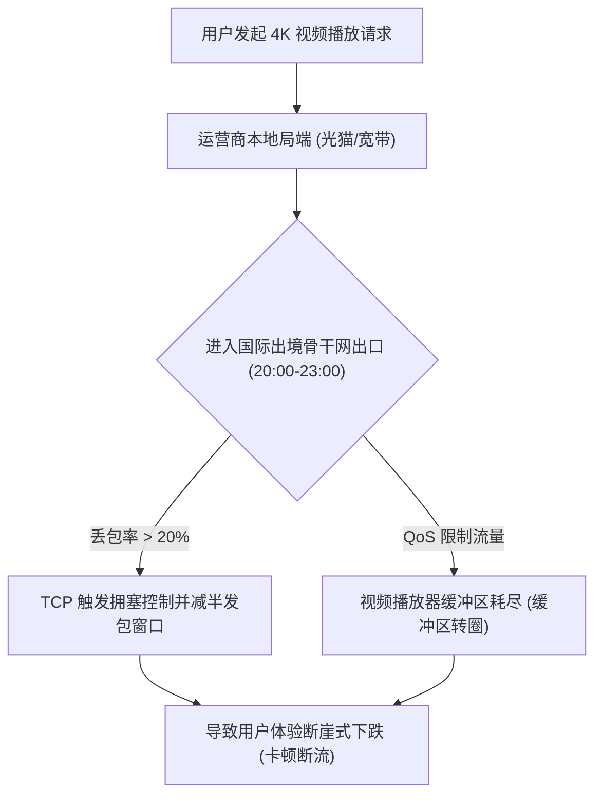

# ⚡ 晚高峰 4K 视频卡顿怎么办？2026 机场节点测速与最优线路选择指南

<ArticleHeader :likes="265" :views="1820" badge="实战调优" badgeClass="badge-top" category="🛠️ 软件与教程中心" date="2026-08-17" id="peak-hour-optimization" tags="晚高峰卡顿, 机场测速, 线路优化, MTU调优, 负载均衡, 节点丢包"/>

<div class="intro-banner" style="background: var(--vp-c-bg-alt); border: 1px solid var(--vp-c-gutter); border-left: 4px solid #0284c7; padding: 1.1rem 1.35rem; border-radius: 8px; margin-bottom: 1.8rem; font-size: 0.95rem; line-height: 1.7; color: var(--vp-c-text-2);">
  <strong>懂哥机导读：</strong>白天测速上千兆，一到晚上 8 点至 11 点晚高峰就频繁卡顿、缓冲转圈甚至节点批量超时（Timeout）？这并不是你的手机或电脑坏了，而是命中了运营商骨干网出境 QoS 限速与网关丢包。本指南将教你使用专业工具科学测速，并从物理层到协议层彻底解决卡顿。
</div>

---

## 1. 晚高峰卡顿与断流根源剖析



在晚高峰阶段，全网国际出口带宽使用率爆满，运营商会优先保障企业专线，而对普通家用宽带的出境 UDP/TCP 流量实施 **QoS (服务质量限制) 强制丢包**。

---

## 2. 科学测速工具白皮书：别再被假延迟骗了！

许多新手在代理客户端里点击“测试延迟”，看到显示 `50ms` 就以为节点极快，结果打开 YouTube 连 1080P 都看不了。

> [!WARNING]
> **延迟陷阱**：客户端自带的 Ping（如 TCP Ping / ICMP Ping）**只代表握手时间**，完全不代表实际的网络带宽和丢包率！

### 推荐专业测速软件：
1. **Stash / Clash Verge 自带 Speedtest**：对所有节点进行真实的 HTTP 文件下载压测。
2. **Stairspeedtest (跑陆测速)**：全平台开源命令行测速软件，可生成详细的节点带宽与丢包率图表。
3. **YouTube 统计信息 (Stats for nerds)**：右键视频开启，重点观察 **Connection Speed** (连接速率) 和 **Buffer Health** (缓冲区健康度)。

---

## 3. 保姆级四步优化实战

### 步骤 1：调整客户端 MTU (最大传输单元) 避免分片丢包

当封装了 TLS / QUIC 加密报文后，数据包容易超过以太网默认的 1500 字节，导致数据包在路由器被强制切分（Fragmentation），增加丢包概率。

```yaml
# 在 Clash / Stash / Shadowrocket 中修改 MTU 设置
tun:
  enable: true
  stack: mixed
  mtu: 1400  # 将默认的 1500 降低为 1400 或 1360 (避免 UDP 分片)
```

---

### 步骤 2：配置 Clash 动态 fallback (自动故障转移与负载均衡)

当主力节点在晚高峰断流时，让客户端自动毫秒级无感切换至备用节点：

```yaml
proxy-groups:
  - name: 🚀 晚高峰自动选路
    type: fallback
    url: 'http://www.gstatic.com/generate_204'
    interval: 30
    proxies:
      - 暮光-香港专线01
      - 暮光-日本专线02
      - 梯子云-新加坡01
```

---

### 步骤 3：切换为 Hysteria 2 / QUIC UDP 协议

如果你使用的机场支持多种协议，在晚高峰阶段，请**果断将节点协议由 Shadowsocks / VMess 切换为 Hysteria 2**。基于 UDP 的 Brutal 算法能有效抵抗 20% 以上的高丢包。

---

## 4. FAQ 常见问题汇总

<details class="faq-card" style="border: 1px solid var(--vp-c-gutter); border-radius: 8px; padding: 0.85rem 1.2rem; margin-bottom: 0.85rem; background: var(--vp-c-bg-alt);">
  <summary style="font-weight: 800; cursor: pointer; color: var(--vp-c-text-1);">Q1: 为什么我的千兆宽带，播放 YouTube 8K 视频时连接速度只有 30000 Kbps (30Mbps)？</summary>
  <div style="margin-top: 0.65rem; font-size: 0.9rem; color: var(--vp-c-text-2); line-height: 1.65;">
    这属于典型的单线程 TCP 瓶颈。YouTube 默认使用单个 TCP 连接传输视频流，在跨境长距离传输（高 RTT 延迟）下，单线程很难吃满千兆带宽。开启 Clash 的 <code>multi-thread</code> 多线程代理加速，或使用支持多并发的代理客户端可大幅提升速度。
  </div>
</details>

<ArticleLikes :initial="265" id="peak-hour-optimization" mode="bottom"/>
