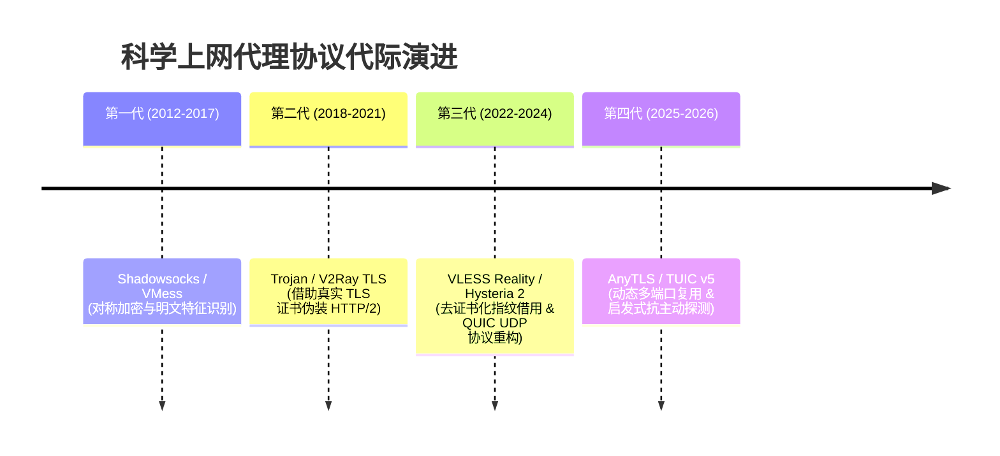

# ⚡ 2026 最新科学上网协议演进：AnyTLS、VLESS 与 Hysteria 2 深度原理解析

<ArticleHeader :likes="410" :views="2420" badge="深度技术" badgeClass="badge-top" category="⚡ AI / 4K解锁专区" date="2026-08-17" id="vless-anytls-hysteria2-explained" tags="VLESS, Hysteria 2, AnyTLS, 协议演进, 抗封锁, QUIC"/>

<div class="intro-banner" style="background: var(--vp-c-bg-alt); border: 1px solid var(--vp-c-gutter); border-left: 4px solid #0284c7; padding: 1.1rem 1.35rem; border-radius: 8px; margin-bottom: 1.8rem; font-size: 0.95rem; line-height: 1.7; color: var(--vp-c-text-2);">
  <strong>懂哥机导读：</strong>翻墙协议的发展史，就是一部与深度包检测（DPI / Active Probing）博弈的进化史。从最早的 Shadowsocks 密码学特征暴露，到 VLESS Reality 的伪装指纹，再到 Hysteria 2 基于 UDP 拥塞控制的晚高峰暴力突破，以及 2026 最新的 AnyTLS 协议。本白皮书将以硬核视角为你全面拆解。
</div>

---

## 1. 代理协议发展四代演进史



---

## 2. 五大主流协议底层技术对比剖析

| 协议名称 | 传输层载体 | 伪装与安全防护原理 | 晚高峰抗丢包能力 | 适合场景与设备 |
| :--- | :--- | :--- | :---: | :--- |
| **Shadowsocks (AEAD)** | TCP / UDP | 纯对称加密封包 | ⭐⭐ (依赖线路) | 老旧客户端、轻量路由器 |
| **VMess + WS + TLS** | TCP (WebSocket) | 经过 Cloudflare CDN 代理 | ⭐⭐⭐ | 需隐藏服务器真实 IP 者 |
| **VLESS (Reality)** | TCP (TLS 1.3) | **借用真实网站 SNI 指纹**，免域名配置 | ⭐⭐⭐⭐ | 追求高隐蔽性、防封锁的主力 |
| **Hysteria 2** | UDP (QUIC) | **Brutal 拥塞控制算法**，忽略丢包强制发包 | ⭐⭐⭐⭐⭐ | **晚高峰千兆卡顿、极度高丢包线路** |
| **AnyTLS** | TCP / UDP 混合 | **动态端口多路复用与伪装握手** | ⭐⭐⭐⭐⭐ | 2026 企业级高并发与 AI 极速解锁 |

---

## 3. 核心协议硬核拆解

### 3.1 VLESS Reality (去除证书依赖的伪装巅峰)

传统的 Trojan / TLS 协议需要用户自行购买域名并申请 SSL 证书，这在服务端留下了域名解析的蛛丝马迹。而 **VLESS Reality** 突破性地采用了“偷梁换柱”的设计：

```bash
客户端请求 ──> 发送包含公认真实域名 SNI (如 dl.google.com) 的 TLS 1.3 握手包
               │
               ├──> 防火墙 Active Probing (主动探测) ──> 转发至真实的 google.com (完全无异常)
               │
               └──> 携带特定 Auth Key 认证 ──> 解密流量并建立代理通道
```

* **核心优势**：不需要域名、无需申请证书，服务端指纹与全球最大的互联网公司完全一致。

---

### 3.2 Hysteria 2 (基于 QUIC 的晚高峰暴力战神)

在晚高峰阶段，电信 163 或移动 CMI 骨干网经常遭遇 **15%~30% 的严重丢包**。传统的 TCP 协议（如 BBR / Cubic）一旦检测到丢包，就会自动触发“拥塞窗口减半”机制，导致网速断崖式下跌。

**Hysteria 2** 采用了自定义的 **Brutal 拥塞控制算法**：

$$\text{Sending Rate} = \text{Target Bandwidth} \times (1 + \text{Loss Rate} \times \alpha)$$

无论网络发生多大比例的丢包，Hysteria 2 都会根据用户预设的期望上/下行带宽，以极高的 UDP 发包速率填充丢包空缺，从而在丢包高达 30% 的劣质网络下依然维持 **4K 8K 视频瞬间加载**。

---

### 3.3 AnyTLS (2026 最新代际协议)

进入 2026 年，针对防火墙对 UDP 报文进行 QoS 丢包限速的现状，**AnyTLS** 协议应运而生。它具备以下革命性特征：

1. **启发式端口跳跃 (Port Hopping)**：客户端与服务端在建立连接时，基于时间戳和动态哈希算法，在数百个开放端口之间实时平滑切换。
2. **零RTT 握手复用**：利用 TLS 1.3 Session Resumption 技术，实现类似 UDP 的极速首包响应。

---

## 4. 保姆级协议选择与调优指南

```yaml
场景 1: 晚高峰观看 YouTube 8K / Netflix 4K 视频频频卡顿缓冲
  推荐协议: Hysteria 2 或 AnyTLS
  参数调优:
    上行带宽 (Upload): 设为宽带实际上行 (如 50Mbps)
    下行带宽 (Download): 设为宽带实际下行 (如 500Mbps)

场景 2: 敏感时期防封锁，使用搬瓦工 / DO 等自建 VPS
  推荐协议: VLESS + REALITY + Vision
  参数调优:
    Dest (目标域名): dl.google.com:443 或 www.microsoft.com:443
    ServerNames: dl.google.com

场景 3: 公司内网防火墙严格封锁非 80/443 端口
  推荐协议: AnyTLS / Trojan over WebSocket
  参数调优: 强制占用 443 端口，伪装 Header 设为标准 HTTP/2
```

---

## 5. FAQ 常见问题汇总

<details class="faq-card" style="border: 1px solid var(--vp-c-gutter); border-radius: 8px; padding: 0.85rem 1.2rem; margin-bottom: 0.85rem; background: var(--vp-c-bg-alt);">
  <summary style="font-weight: 800; cursor: pointer; color: var(--vp-c-text-1);">Q1: 为什么 Hysteria 2 速度极快，但在部分地区用一会儿就会断网？</summary>
  <div style="margin-top: 0.65rem; font-size: 0.9rem; color: var(--vp-c-text-2); line-height: 1.65;">
    这是因为部分地方运营商（如江苏移动、四川电信）对 UDP 流量实施了极其严厉的 QoS 限速或阻断。如果你在 Hysteria 2 配置中填写的带宽过高（如误填为 1000M），会导致运营商防火墙直接阻断你的 UDP 端口。解决办法是适当降低 Hysteria 2 的期望下行带宽值，或改用 <strong>VLESS Reality</strong> 协议。
  </div>
</details>

<details class="faq-card" style="border: 1px solid var(--vp-c-gutter); border-radius: 8px; padding: 0.85rem 1.2rem; margin-bottom: 0.85rem; background: var(--vp-c-bg-alt);">
  <summary style="font-weight: 800; cursor: pointer; color: var(--vp-c-text-1);">Q2: 2026 年自建节点翻墙还划算吗？</summary>
  <div style="margin-top: 0.65rem; font-size: 0.9rem; color: var(--vp-c-text-2); line-height: 1.65;">
    对于絕大多数非网络专业用户而言，<strong>自建 VPS 极不划算</strong>。自建节点不仅月费高昂（普通 IPLC 专线 VPS 动辄每月数十美元），且缺乏 BGP 多入口中转，遭遇阻断后更换 IP 成本极高。懂哥机建议优先选择具备 IEPL 专线的成熟机场。
  </div>
</details>

<ArticleLikes :initial="410" id="vless-anytls-hysteria2-explained" mode="bottom"/>
