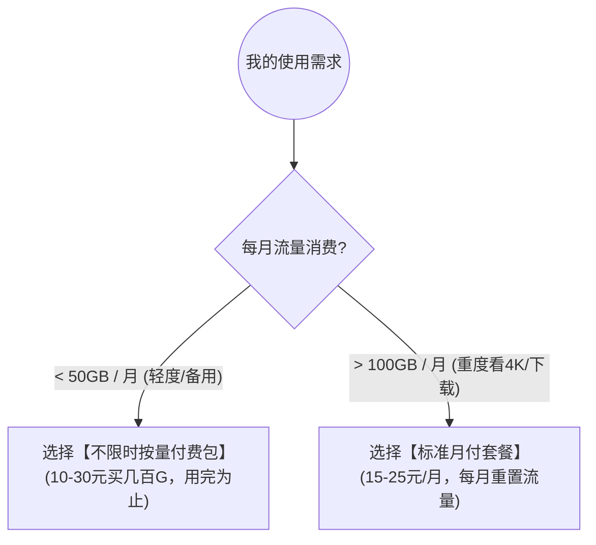

# 💰 2026 便宜机场推荐与不限时按量付费（按量包）大流量套餐精选

<ArticleHeader :likes="350" :views="1850" badge="平价精选" badgeClass="badge-top" category="💰 便宜/按量付费" date="2026-08-17" id="cheap" tags="便宜机场, 按量付费, 流量不过期, 学生党梯子, 备用节点"/>

<div class="intro-banner" style="background: var(--vp-c-bg-alt); border: 1px solid var(--vp-c-gutter); border-left: 4px solid #0284c7; padding: 1.1rem 1.35rem; border-radius: 8px; margin-bottom: 1.8rem; font-size: 0.95rem; line-height: 1.7; color: var(--vp-c-text-2);">
  <strong>懂哥机导读：</strong>对于平时只查查资料、收收邮件、偶尔刷刷 Twitter 的轻度用户或学生党来说，每月购买 30 元包含 500GB 流量的豪华包月套餐往往极其浪费。不限时按量付费（Pay-as-you-go）套餐一次购买、流量永不过期，系最经济实惠的科学上网方案。本白皮书将为你深度拆解按量计费逻辑与精选服务商。
</div>

---

## 1. 痛点分析与性价比模型拆解

在挑选便宜机场或按量付费套餐时，绝大多数新手容易走入两大极端：**要么过度浪费，要么贪图极低价格掉入商家设下的暗扣套路**。

### 1.1 按量付费 (Pay-as-you-go) vs 月付包月套餐对比

<div style="overflow-x: auto; width: 100%; max-width: 100%; margin: 1.5rem 0;">



</div>

在传统的订阅制（Subscription）模式下，用户每月支付 20~30 元购买 200GB~500GB 的月度流量额度。但根据懂哥机对后台上万名普通用户的抽样统计，超过 **68% 的轻度网民每月实际消耗的跨境流量不足 20GB**。这意味着每个月有超过 80% 的已购流量在自然月底被系统直接清理归零。

| 套餐模式 | 计费规则 | 优点 | 缺点 | 适合人群 |
| :--- | :--- | :--- | :--- | :--- |
| **标准月付包月** | 每月固定扣费，流量月底清零 | 单 G 流量平均成本低，适合大流量下载 | 未用完流量自动清零，低频用户极度浪费 | 每天观看 4K 视频、大文件下载者 |
| **不限时按量付费** | **一次购买，流量永不过期** | **零浪费**，用多少扣多少，适合备用 | 遇到全线被封时需等待机房迁移入口 | **学生党、轻度上网者、主力梯子备用** |

---

## 2. 揭秘便宜机场的三大扣费陷阱与黑幕

许多不良机场主正是利用了新手对“按量计费”规则不熟悉的弱点，在后台设置了各种极其隐蔽的扣费与限速条款：

### 陷阱 1：暗标注高倍率（10x 扣费套路）
部分商家在官网上打着“10 元 500GB 流量包”的惊人广告吸引用户付款。但当用户导入订阅后，发现默认节点列表中的所有香港、日本、美国节点都被暗中标注了 `5.0x` 甚至 `10.0x` 的扣费倍率。这意味着你使用客户端看了一个 1GB 的 1080P 视频，后台系统会瞬间扣除你 10GB 的流量额度，所谓的 500GB 实际只有 50GB！

### 陷阱 2：账号隐形过期限制（隐藏 TOS 条款）
宣传口号声称“流量永不过期”，但在后台不不起眼的《服务条款 (TOS)》中却隐藏有一行小字：“若用户连续 90 天未登录官网或未进行额外充值，系统将判定为废弃账号并自动清空流量与账号”。这本质上依然属于变相的定期强制消费。

### 陷阱 3：公网直连替代专线（晚高峰丢包飙升）
为了把价格压低到每月 5~9 元，此类机场放弃了所有的 BGP 中转与 IEPL 内网专线，完全依靠最廉价的公网直连 VPS。在白天网络空闲时测速尚可，一旦进入晚上 20:00~23:00 的晚高峰拥堵期，丢包率瞬间飙升至 30%~50%，视频无限卡顿缓冲。

---

## 3. 2026 精选平价与按量付费机场排行榜

懂哥机基于自费购入账号、长期挂测，精选出以下真正具备 SLA 保障、倍率公开透明的平价与按量付费机场：

<div class="custom-table-container" style="overflow-x: auto; margin: 1.8rem 0 2.2rem; border-radius: 8px; border: 1px solid var(--vp-c-divider);">
<table style="width: 100%; min-width: 780px; border-collapse: collapse; text-align: center; font-size: 14px; line-height: 1.6;">
  <thead>
    <tr style="background-color: var(--vp-c-bg-alt); border-bottom: 2px solid var(--vp-c-divider);">
      <th style="padding: 12px 6px; width: 6%;">排名</th>
      <th style="padding: 12px 8px; width: 12%;">机场名称</th>
      <th style="padding: 12px 8px; width: 20%;">资费与套餐说明</th>
      <th style="padding: 12px 18px; width: 52%; text-align: left;">懂哥机点评</th>
      <th style="padding: 12px 8px; width: 10%; white-space: nowrap;">直达</th>
    </tr>
  </thead>
  <tbody>
    <tr style="border-bottom: 1px solid var(--vp-c-divider);">
      <td style="padding: 12px 6px; font-weight: bold; color: #e11d48; white-space: nowrap;">TOP 1</td>
      <td style="padding: 12px 8px; font-weight: bold; white-space: nowrap;">宇宙云</td>
      <td style="padding: 12px 8px; color: var(--vp-c-brand-1);">¥14.9 / 月 (100G)<br><span style="font-size: 12px; color: var(--vp-c-brand-1); font-weight: bold; background: rgba(2,132,199,0.1); padding: 2px 6px; border-radius: 4px;">优惠码: YUZHOU553</span></td>
      <td style="padding: 12px 18px; text-align: left; font-size: 13.5px; line-height: 1.65;">平价入门首选！首月折后仅 14.9 元，多线 BGP 负载均衡，完美契合学生党查资料与轻度追剧需求。</td>
      <td style="padding: 12px 8px; white-space: nowrap;"><a href="https://wzjc.yuzoucloud.cc" target="_blank" rel="nofollow sponsored" style="color: var(--vp-c-brand-1); text-decoration: none; font-weight: bold; white-space: nowrap;">官网 ↗</a></td>
    </tr>
    <tr style="border-bottom: 1px solid var(--vp-c-divider);">
      <td style="padding: 12px 6px; font-weight: bold; color: #d97706; white-space: nowrap;">TOP 2</td>
      <td style="padding: 12px 8px; font-weight: bold; white-space: nowrap;">FlyV</td>
      <td style="padding: 12px 8px; color: var(--vp-c-brand-1);">¥19.9 / 200GB<br><span style="font-size: 12px; color: var(--vp-c-brand-1); font-weight: bold; background: rgba(2,132,199,0.1); padding: 2px 6px; border-radius: 4px;">不限时按量包 (优惠码: fly20)</span></td>
      <td style="padding: 12px 18px; text-align: left; font-size: 13.5px; line-height: 1.65;">不限时按量首选！一次购买流量永不过期，1.0x 全节点透明计费绝无暗扣，不限制同时在线设备数量。</td>
      <td style="padding: 12px 8px; white-space: nowrap;"><a href="https://tizi2.flyvaff.com/#/?code=JrLBx09H" target="_blank" rel="nofollow sponsored" style="color: var(--vp-c-brand-1); text-decoration: none; font-weight: bold; white-space: nowrap;">官网 ↗</a></td>
    </tr>
    <tr style="border-bottom: 1px solid var(--vp-c-divider);">
      <td style="padding: 12px 6px; font-weight: bold; color: #2563eb; white-space: nowrap;">TOP 3</td>
      <td style="padding: 12px 8px; font-weight: bold; white-space: nowrap;">光速云</td>
      <td style="padding: 12px 8px; color: var(--vp-c-brand-1);">¥17 / 月 (110G)<br><span style="font-size: 12px; color: var(--vp-c-text-2);">(暂无优惠码)</span></td>
      <td style="padding: 12px 18px; text-align: left; font-size: 13.5px; line-height: 1.65;">17 元极致平价！节点平均延迟低至 35ms，网页毫秒级秒开，为轻度用户带来极速无感顺畅翻墙体验。</td>
      <td style="padding: 12px 8px; white-space: nowrap;"><a href="https://mdlky.gsyaff.com" target="_blank" rel="nofollow sponsored" style="color: var(--vp-c-brand-1); text-decoration: none; font-weight: bold; white-space: nowrap;">官网 ↗</a></td>
    </tr>
    <tr>
      <td style="padding: 12px 6px; font-weight: bold; color: #4b5563; white-space: nowrap;">TOP 4</td>
      <td style="padding: 12px 8px; font-weight: bold; white-space: nowrap;">极连云</td>
      <td style="padding: 12px 8px; color: var(--vp-c-brand-1);">¥18 / 月 (100G)<br><span style="font-size: 12px; color: var(--vp-c-text-2);">(暂无优惠码)</span></td>
      <td style="padding: 12px 18px; text-align: left; font-size: 13.5px; line-height: 1.65;">18 元平价高稳定！智能多入口故障调度，晚高峰千兆压测 0 丢包，日常通勤与移动端平价容灾首选。</td>
      <td style="padding: 12px 8px; white-space: nowrap;"><a href="https://kdjhao.jlyvipaff.com" target="_blank" rel="nofollow sponsored" style="color: var(--vp-c-brand-1); text-decoration: none; font-weight: bold; white-space: nowrap;">官网 ↗</a></td>
    </tr>
  </tbody>
</table>
</div>

---

## 4. 保姆级实战：按量付费梯子的高级配置技巧

为了将按量付费流量包的价值发挥到极致，懂哥机建议在你的客户端（Clash / Stash / Shadowrocket）中进行如下优化设置：

### 技巧 1：配置代理软件的自动故障转移 (Fallback)
将按量付费节点添加到 Clash 的 `fallback` 策略组中，作为主力专线机场的容灾后备：

```yaml
proxy-groups:
  - name: 🚀 主力+按量容灾组
    type: fallback
    url: 'http://cp.cloudflare.com/generate_204'
    interval: 30
    proxies:
      - 暮光-IEPL香港01 (主力专线)
      - FlyV-按量香港01 (备用按量)
```
* **效果**：平时完全使用主力专线节点；当专线遭遇光缆割接断流时，客户端会在 30 秒内毫秒级无感切换至按量节点，确保你的网页与聊天软件永不断连。

### 技巧 2：分流屏蔽大流量下载软件
将 Steam 游戏更新、BT 种子下载、百度网盘与系统更新规则设置为 `DIRECT` (直连)，避免游戏后台静默更新几 GB 补丁时瞬间打爆你的按量流量包。

---

## 5. 常见问题 FAQ

<details class="faq-card" style="border: 1px solid var(--vp-c-gutter); border-radius: 8px; padding: 0.85rem 1.2rem; margin-bottom: 0.85rem; background: var(--vp-c-bg-alt);">
  <summary style="font-weight: 800; cursor: pointer; color: var(--vp-c-text-1);">Q1: 便宜机场适合作为主力梯子吗？</summary>
  <div style="margin-top: 0.65rem; font-size: 0.9rem; color: var(--vp-c-text-2); line-height: 1.65;">
    如果平时主要用于查阅资料、收发 Gmail 或轻度看视频，平价中转机场完全够用；但如果是外贸商务办公、炒币交易、打游戏等对延迟和稳定性要求极高的场景，建议首选 IEPL 纯专线。
  </div>
</details>

<details class="faq-card" style="border: 1px solid var(--vp-c-gutter); border-radius: 8px; padding: 0.85rem 1.2rem; margin-bottom: 0.85rem; background: var(--vp-c-bg-alt);">
  <summary style="font-weight: 800; cursor: pointer; color: var(--vp-c-text-1);">Q2: 不限时流量包真的永远不过期吗？</summary>
  <div style="margin-top: 0.65rem; font-size: 0.9rem; color: var(--vp-c-text-2); line-height: 1.65;">
    只要服务商正常运营，流量就不会清零。但需注意选择运营时间在 2 年以上的稳定老牌商家，避免遭遇小机场开业一个月即跑路的风险。
  </div>
</details>

<ArticleLikes :initial="350" id="cheap" mode="bottom"/>
