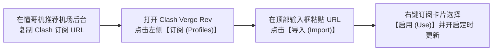

# 🛠️ 2026 Clash Verge Rev 最新版下载、Tun 模式配置与高阶 Script 分流指南

<ArticleHeader :likes="450" :views="3100" badge="必备神器" badgeClass="badge-top" category="🛠️ 软件与教程中心" date="2026-08-17" id="clash-verge-guide" tags="Clash Verge Rev, Mihomo内核, TUN模式, 订阅导入, Windows翻墙, macOS翻墙"/>

<div class="intro-banner" style="background: var(--vp-c-bg-alt); border: 1px solid var(--vp-c-gutter); border-left: 4px solid #0284c7; padding: 1.1rem 1.35rem; border-radius: 8px; margin-bottom: 1.8rem; font-size: 0.95rem; line-height: 1.7; color: var(--vp-c-text-2);">
  <strong>懂哥机导读：</strong>原 Clash for Windows (CFW) 停止维护后，**Clash Verge Rev** 凭凭借其基于 Tauri 框架打造的极轻量性能、对 Mihomo (Clash Meta) 内核的原生完美支持以及极具现代感的 UI 界面，已成为 2026 年全网公认第一的桌面端科学上网神器。
</div>

---

## 1. 痛点分析与官方下载避坑

在下载与安装 Clash Verge Rev 时，绝大多数新手面临着极其严峻的**钓鱼镜像站与毒木马风险**：

1. **搜索引擎广告钓鱼站（木马投毒）**：在百度、Bing 搜索“Clash 官网”或“Clash Verge 下载”，首页排名前几位的往往是盗版钓鱼网站。这些打包好的 EXE 安装包被植入了后门程序，专门窃取用户的 Telegram 密钥、火狐/谷歌浏览器密码与加密货币钱包。
2. **系统代理设置失效（软件能上网，终端/UWP 无法翻墙）**：普通代理模式仅能接管浏览器 HTTP 流量，对于 CMD、PowerShell、Git 命令行、Telegram 桌面端及 Windows 商店应用无效。
3. **老旧 Core 不支持新协议**：使用老旧的 Clash Premium 内核，导致机场的 Hysteria 2、VLESS Reality 节点全部报错无响应。

---

## 2. 官方开源安全下载通道白皮书

> [!CAUTION]
> **安全铁律**：切勿在任何非 GitHub Release 渠道或百度网盘分享链接下载 Clash 安装包！认准唯一开源发布端。

| 操作系统平台 | 安装包文件名格式 | 适用硬件架构 |
| :--- | :--- | :--- |
| **Windows 64位** | `Clash.Verge_1.x.x_x64-setup.exe` | Intel / AMD x86_64 绝大多数电脑 |
| **Windows ARM64** | `Clash.Verge_1.x.x_arm64-setup.exe` | 联想 ThinkPad X13s, Surface Pro 等 ARM 设备 |
| **macOS (Apple Silicon)** | `Clash.Verge_1.x.x_aarch64.dmg` | M1 / M2 / M3 / M4 芯片 Mac |
| **macOS (Intel 芯片)** | `Clash.Verge_1.x.x_x64.dmg` | 2020 年及之前老款 Intel 芯片 Mac |

---

## 3. 保姆级实战配置流程

### 步骤 1：导入机场 Clash 订阅链接



1. 打开 Clash Verge Rev，点击左侧菜单栏的 `订阅 (Profiles)`。
2. 在右上角 URL 输入框中粘贴机场提供的订阅链接，点击 `导入` (Import)。
3. 导入成功后，选中该配置文件（边框变为蓝色激活状态）。
4. 右键该订阅，设置 `自动更新间隔 (h)` 为 **12 小时**。

---

### 步骤 2：切换 Mihomo (Clash Meta) 内核以解锁 Hysteria 2

1. 点击左侧 `设置 (Settings)`。
2. 找到 `Clash 内核 (Clash Core)` 选项。
3. 将默认内核切换为 **Mihomo (Clash Meta)**。
4. 开启 `重启服务 (Restart Core)`，即可获得对 VLESS Reality、Hysteria 2 和 TUIC 协议的原生支持。

---

### 步骤 3：开启系统级 TUN 模式（全网全流量无感接管）

为了解决 Git 命令行、Steam 游戏客户端、Telegram 以及 UWP 应用无法走代理的问题：

1. 进入 `设置 (Settings)` -> 打开 `TUN 模式 (Tun Mode)` 开关。
2. 首次开启时，软件会弹窗提示安装系统虚拟网卡驱动（服务模式），点击 `授权/安装`。
3. 安装完成后，将 `堆栈 (Stack)` 修改为 **Mixed** 或 **System**，将 `MTU` 设为 **1400**。此时全台电脑的所有网络封包将自动无感经过 Clash 代理分流。

---

## 4. 进阶高阶技巧：扩展 Merge 脚本编写

无需手动修改机场订阅文件，通过 Clash Verge Rev 的 `扩展脚本 (Merge Script)` 功能，可以在每次更新订阅时自动注入你自定义的本地节点与路由规则。

点击 `订阅` -> 右键配置文件选择 `编辑脚本`：

```javascript
// Clash Verge Rev 动态 Merge 扩展示例
function main(config) {
  // 1. 注入自定义 AI 专属策略组
  config['proxy-groups'].push({
    name: '🤖 AI 专用通道',
    type: 'select',
    proxies: ['美国-住宅原生01', '新加坡-专线02', 'DIRECT']
  });

  // 2. 在规则列表头部插入强制分流
  config.rules.unshift(
    'DOMAIN-SUFFIX,openai.com,🤖 AI 专用通道',
    'DOMAIN-SUFFIX,anthropic.com,🤖 AI 专用通道',
    'DOMAIN-SUFFIX,claude.ai,🤖 AI 专用通道'
  );

  return config;
}
```

---

## 5. FAQ 常见问题汇总

<details class="faq-card" style="border: 1px solid var(--vp-c-gutter); border-radius: 8px; padding: 0.85rem 1.2rem; margin-bottom: 0.85rem; background: var(--vp-c-bg-alt);">
  <summary style="font-weight: 800; cursor: pointer; color: var(--vp-c-text-1);">Q1: 开启 Clash Verge Rev 后，为什么 UWP 应用（如 Windows 商店/Xbox）提示无网络？</summary>
  <div style="margin-top: 0.65rem; font-size: 0.9rem; color: var(--vp-c-text-2); line-height: 1.65;">
    Windows 系统默认禁止 UWP 应用访问本机的 127.0.0.1 代理端口。请在 Clash Verge Rev 的【设置】中点击 <strong>Windows 隔离解除工具 (Enable Loopback)</strong>，勾选对应的 UWP 应用并点击 Save Changes 即可恢复。
  </div>
</details>

<details class="faq-card" style="border: 1px solid var(--vp-c-gutter); border-radius: 8px; padding: 0.85rem 1.2rem; margin-bottom: 0.85rem; background: var(--vp-c-bg-alt);">
  <summary style="font-weight: 800; cursor: pointer; color: var(--vp-c-text-1);">Q2: 软件提示 "Start Core Failed" 内核启动失败怎么解决？</summary>
  <div style="margin-top: 0.65rem; font-size: 0.9rem; color: var(--vp-c-text-2); line-height: 1.65;">
    这通常是因为端口被其它软件（如旧版 CFW 或 360 安全卫士）占用，或者订阅 YAML 文件语法损坏。请在【设置 - 还原设置】中重置 7890 端口，或切换为 Mihomo 内核重试。
  </div>
</details>

<ArticleLikes :initial="450" id="clash-verge-guide" mode="bottom"/>
