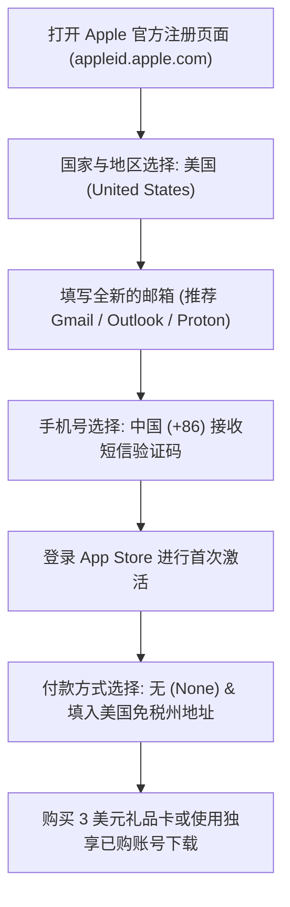

# 🛠️ 2026 Shadowrocket (小火箭) 购买下载、节点配置与规则分流深度教程

<ArticleHeader :likes="348" :views="2180" badge="保姆级教程" badgeClass="badge-top" category="🛠️ 软件与教程中心" date="2026-08-17" id="shadowrocket-guide" tags="Shadowrocket, 小火箭, iOS翻墙, 规则分流, Apple ID"/>

<div class="intro-banner" style="background: var(--vp-c-bg-alt); border: 1px solid var(--vp-c-gutter); border-left: 4px solid #0284c7; padding: 1.1rem 1.35rem; border-radius: 8px; margin-bottom: 1.8rem; font-size: 0.95rem; line-height: 1.7; color: var(--vp-c-text-2);">
  <strong>懂哥机导读：</strong>Shadowrocket（俗称小火箭）是 iOS 平台上历史最悠久、生态最成熟、性价比极高的代理客户端。只要 2.99 美元即可终身买断。本教程从免信用卡注册美区 Apple ID 讲起，涵盖节点导入、分流规则配置、HTTPS 证书安装与极端网络环境下的调优排错。
</div>

---

## 1. 痛点分析与美区 Apple ID 获取避坑

在 iOS 生态下，由于中国大陆区 App Store 的政策限制，所有代理工具（Shadowrocket、Stash、Quantumult X 等）均已被下架。许多新手在购买小火箭时常遇到以下三大致命陷阱：

1. **直接在国区 App Store 搜索下载伪劣冒牌软件**：许多名称带有“小火箭”、“Shadowrocket VPN”的内购订阅软件系恶意的圈钱软件或恶意抓包软件。
2. **在淘宝/拼多多购买共享美区 Apple ID 导致锁机**：共享账号如果直接在 iOS 的【设置 - iCloud】中登录，一旦商家修改密码或开启双重验证，你的 iPhone 将沦为“砖头”。
3. **充值卡被封号（Redeem Code 风险）**：在不合规平台购买使用黑卡刷出来的 Apple Gift Card 兑换码，会导致 Apple 账号及设备被永久封禁。

---

### 1.1 零成本免信用卡注册美区 Apple ID 核心步骤

> [!IMPORTANT]
> **安全铁律**：注册并登录外区 Apple ID 时，**切勿在【设置 - 顶部头像 (iCloud)】中登录！** 必须且只能在 **【App Store - 右上角头像】** 中进行切换！



#### 免税州地址推荐（防止支付 8%~10% 的消费税）：
- **俄勒冈州 (Oregon)**：Zip Code: `97201`, City: `Portland`, Street: `1234 SW Broadway`
- **特拉华州 (Delaware)**：Zip Code: `19702`, City: `Newark`, Street: `500 Continental Dr`
- **阿拉斯加州 (Alaska)**：Zip Code: `99501`, City: `Anchorage`, Street: `745 W 4th Ave`

---

## 2. Shadowrocket 底层协议与核心功能拆解

Shadowrocket 不仅仅是一个简单的 Shadowsocks 客户端，它拥有极其强大的底层网络堆栈和规则引擎：

| 核心特性/协议 | 支持情况 | 技术实现与优势 |
| :--- | :---: | :--- |
| **支持协议族** | 100% 全覆盖 | Shadowsocks, VMess, VLESS (Reality/Vision), Trojan, Hysteria 2, TUIC v5, AnyTLS |
| **DNS 解析引擎** | 智能双栈 | 支持 DoH (DNS over HTTPS)、DoT (DNS over TLS) 与 UDP 混合分流解析 |
| **规则匹配引擎** | 高性能 C++ | 支持 DOMAIN-SUFFIX, IP-CIDR, GEOIP, USER-AGENT, SCRIPT 脚本重写 |
| **TUN 网卡转发** | 系统级抓包 | 拦截全局 TCP/UDP 流量，自动处理 IPv6 泄漏与 DNS 污染 |

---

## 3. 保姆级实战操作手册

### 步骤 1：导入机场节点订阅

打开 Shadowrocket 主界面，点击右上角的 `+` 号：

```yaml
配置参数说明:
  类型 (Type): Subscribe (或选择自动识别)
  URL: 粘贴机场提供的 Shadowrocket / Clash / V2ray 订阅链接
  备注 (Remark): 懂哥机优质专线
  自动更新: 开启 (设置 -> 自动更新 -> 打开按时更新)
```

> [!TIP]
> 如果订阅失败，请在【设置 - 延迟测试】中将测试网址由默认的 `http://www.google.com/gen_204` 修改为 `http://cp.cloudflare.com/generate_204` 或 `http://connect.rom.miui.com/generate_204`。

---

### 步骤 2：配置高性能分流规则 (避免全局代理)

默认的 `Proxy` (代理) 模式会导致访问国内淘宝、微信、Bilibili 时同样经过海外节点，造成卡顿与流量浪费。建议切换为 `Config` (配置) 模式：

1. 打开底部 `配置` (Config) 标签页。
2. 点击右上角 `+` 号，输入全网公认的高性能规则地址：
   `https://raw.githubusercontent.com/Loyalsoldier/clash-rules/release/shadowrocket.conf`
3. 下载完成后，点击该配置文件并选择 **使用配置 (Use Config)**。

---

### 步骤 3：开启 HTTPS 解密 (用于广告拦截与脚本重写)

部分高级分流与广告拦截需要开启 HTTPS 证书解密：

1. 进入【设置】 -> 【证书】 -> 【安装 Certificate】。
2. 系统会弹窗提示下载描述文件，在 iOS【设置 - 已下载描述文件】中点击安装。
3. 进入 iOS【设置 - 通用 - 关于本机 - 证书信任设置】，将 Shadowrocket 根证书开关勾选为 **完全信任**。
4. 返回 Shadowrocket 首页，开启 `HTTPS 解密` 开关即可。

---

## 4. 进阶调试与极端场景处理

### 场景 A：OpenAI (ChatGPT) / Claude 提示 "Access Denied" 或 1020 报错

**原因**：节点 IP 欺诈分值过高（Fraud Score > 50），或节点域名解析命中了默认的代理组而非住宅原生 IP 节点。

**解决方案**：
1. 在 Shadowrocket 首页找到【配置】-> 点击当前配置右侧的 `i` 图标。
2. 进入【规则 (Rules)】-> 点击右上角 `+` 添加自定义规则：
   - 规则类型：`DOMAIN-KEYWORD`
   - 匹配内容：`openai` / `anthropic`
   - 策略 (Policy)：选择机场专用的 `US-Residential` (美国原生IP) 策略组。

### 场景 B：晚高峰玩外服游戏 (如王者荣耀国际服 / Steam 联机) 延迟高、丢包率高

**原因**：Shadowrocket 默认的 UDP 转发模式可能被系统限速，或机场节点不支持 UDP 代理。

**解决方案**：
1. 进入【设置】-> 【UDP】。
2. 将 UDP 转发机制修改为 `UDP-Relay` 或开启 `Tun Only` 模式。
3. 开启 `MPTCP` (多路径 TCP) 提升网络抗抖动能力。

---

## 5. FAQ 常见问题汇总

<details class="faq-card" style="border: 1px solid var(--vp-c-gutter); border-radius: 8px; padding: 0.85rem 1.2rem; margin-bottom: 0.85rem; background: var(--vp-c-bg-alt);">
  <summary style="font-weight: 800; cursor: pointer; color: var(--vp-c-text-1);">Q1: 为什么连接小火箭后，微信发不出消息或提示无网络？</summary>
  <div style="margin-top: 0.65rem; font-size: 0.9rem; color: var(--vp-c-text-2); line-height: 1.65;">
    这通常是因为路由规则误将微信的短连接服务器分流到了代理节点。请检查首页路由模式是否误开启了 <strong>Proxy (全局代理)</strong>，将其切换回 <strong>Config (配置)</strong> 模式；若仍异常，请在【设置 - 还原设置】中重置网络规则。
  </div>
</details>

<details class="faq-card" style="border: 1px solid var(--vp-c-gutter); border-radius: 8px; padding: 0.85rem 1.2rem; margin-bottom: 0.85rem; background: var(--vp-c-bg-alt);">
  <summary style="font-weight: 800; cursor: pointer; color: var(--vp-c-text-1);">Q2: 小火箭提示 "Certificate Unstrusted" 或网页无法打开？</summary>
  <div style="margin-top: 0.65rem; font-size: 0.9rem; color: var(--vp-c-text-2); line-height: 1.65;">
    如果你开启了 HTTPS 解密，必须去 iOS 的【设置 - 通用 - 关于本机 - 证书信任设置】中手动开启对 Shadowrocket 生成的 MitM 根证书的完全信任开关。
  </div>
</details>

<ArticleLikes :initial="348" id="shadowrocket-guide" mode="bottom"/>
