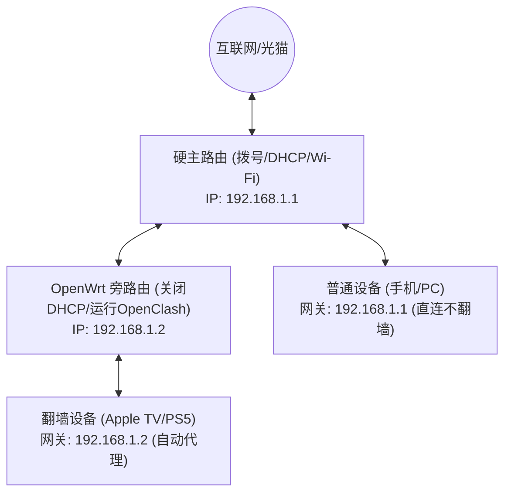

# 🏠 2026 软路由全屋科学上网指南：OpenWrt / ImmortalWrt + OpenClash 旁路由部署

<ArticleHeader :likes="295" :views="1980" badge="硬核部署" badgeClass="badge-top" category="🛠️ 软件与教程中心" date="2026-08-17" id="soft-router" tags="软路由, OpenWrt, OpenClash, 旁路由, 全屋翻墙, Apple TV"/>

<div class="intro-banner" style="background: var(--vp-c-bg-alt); border: 1px solid var(--vp-c-gutter); border-left: 4px solid #0284c7; padding: 1.1rem 1.35rem; border-radius: 8px; margin-bottom: 1.8rem; font-size: 0.95rem; line-height: 1.7; color: var(--vp-c-text-2);">
  <strong>懂哥机导读：</strong>软路由是科学上网的终极形态。通过在家庭网络中部署运行 OpenWrt / ImmortalWrt 系统的软路由，可以实现全屋手机、电脑、智能电视（Apple TV / 索尼）、游戏主机（PS5 / Switch / Xbox）无需安装任何客户端即可无感高速翻墙。
</div>

---

## 1. 痛点分析与拓扑架构选型

在构建全屋科学上网网络时，绝大部分用户面临的最大瓶颈不是节点速度，而是**路由拓扑选型错误**：

1. **主路由性能不足与死机**：直接使用移动运营商赠送的千元内无线路由器运行 OpenClash，导致 CPU 占用率 100% 爆表、频繁死机。
2. **旁路由 DNS 环路与网络回旋（DNS Loop）**：网关设置不当导致 DNS 请求在主路由与旁路由之间无限死循环，全屋设备断网。
3. **国内流量绕远路（吞吐量减半）**：内网所有访问百度、微信的流量均被迫经过旁路由 CPU 转发，导致原本 1000M 的宽带被限制在 300M 左右。

---

### 1.1 经典网络拓扑方案对比



| 部署方案 | 优点 | 缺点 | 适用人群 |
| :--- | :--- | :--- | :--- |
| **主路由单臂模式** | 节省硬件成本，单网口即可运行 | 软路由故障会导致全屋彻底断网 | 极客玩家、单网口设备 (如 N1 盒子) |
| **主路由 + 旁路由 (推荐)** | **网络抗风险能力极高**。软路由断电不影响全屋基础上网 | 需要手动修改特定设备的网关 IP | 绝大多数家庭用户、有 Apple TV / PS5 者 |
| **双网口物理直连** | 性能损耗极小，NAT 转换效率高 | 成本稍高，需购买多网口 X86 软路由 | 追求极致千兆跑满的硬核玩家 |

---

## 2. 硬件选型白皮书 (2026 推荐)

针对不同的宽带速率与并发需求，懂哥机推荐以下成熟硬件方案：

```yaml
低预算方案 (百元级):
  硬件: 友善电子 NanoPi R2S / R4S 或 斐讯 N1 (刷 ImmortalWrt)
  适用宽带: 300M - 500M 宽带
  核心优势: 功耗低于 5W，价格便宜

主流高性价比方案 (300-500元):
  硬件: Intel N5105 / J4125 四网口 2.5G 小主机
  适用宽带: 1000M - 2500M 宽带 (支持 AES-NI 硬件加速)
  核心优势: 散热好，可作为 PVE / ESXi 虚拟化底层服务器

极致性能方案 (1000元+):
  硬件: Intel N100 / Core i3-1215U 软路由
  适用宽带: 千兆晚高峰跑满 + 运行 Hysteria 2 / QUIC 高级加密协议
  核心优势: 支持多并发高丢包环境下的 UDP 乱序重排
```

---

## 3. 保姆级旁路由实战部署

### 步骤 1：OpenWrt 接口网络参数设置

登录 OpenWrt 后台，进入【网络】-> 【接口】-> 【LAN 接口】：

```bash
# 静态 IPv4 配置示例
IPv4 地址: 192.168.1.2 (必须与主路由在同一网段)
IPv4 子网掩码: 255.255.255.0
IPv4 网关: 192.168.1.1 (主路由 IP)
自定义 DNS 服务器: 192.168.1.1 或 119.29.29.29

# 关键设置: 必须勾选【忽略此接口】(关闭 DHCP 服务，避免与主路由冲突)
```

---

### 步骤 2：解决 IP 动态伪装与防火墙自定义规则

旁路由下国内流量无法上网或连接卡顿，通常是因为缺少 iptables 转发规则。

进入【网络】-> 【防火墙】-> 【自定义规则】，添加以下关键规则：

```bash
# 允许 LAN 区网段流量进行 MSS 伪装匹配
iptables -t nat -A POSTROUTING -j MASQUERADE

# 针对 Fake-IP 模式开启 TUN 流量重定向
iptables -t nat -A PREROUTING -p udp --dport 53 -j REDIRECT --to-ports 53
iptables -t nat -A PREROUTING -p tcp --dport 53 -j REDIRECT --to-ports 53
```

---

### 步骤 3：OpenClash 内核与 Fake-IP 模式配置

1. 打开 OpenClash -> 【全局设置】 -> 【模式设置】。
2. 运行模式选择 **Fake-IP (混合模式)** 或 **TUN 模式**。
3. 勾选 `使用 Meta 内核` (Mihomo)，以获得对 Hysteria 2 与 VLESS Reality 协议的原生支持。
4. 在【DNS 设置】中，开启 `本地 DNS 截获`，并将国内 DNS 设为 `119.29.29.29` (腾讯 DNS)，国外 DNS 设为 `https://1.1.1.1/dns-query` (Cloudflare DoH)。

---

## 4. 进阶调试：Apple TV / PS5 NAT 类型优化

### 场景：PS5 联机提示 NAT Type 3 (严格)，游戏联机频繁掉线

**原因**：经过旁路由二次 NAT 转换后，UPnP 映射失效。

**解决方案**：
1. 进入 OpenClash -> 【高级设置】。
2. 开启 `UDP 旁路转发` (UDP Bypass)。
3. 在客户端规则（Rule）中，将 PS5 和 Nintendo Switch 的 IP 设为 `DIRECT` (直连模式)，由硬主路由直接负责游戏封包的 UPnP / Full-Cone NAT 转换：

```yaml
rules:
  - SRC-IP-CIDR,192.168.1.150/32,DIRECT # PS5 静态 IP
  - SRC-IP-CIDR,192.168.1.151/32,DIRECT # Switch 静态 IP
```

---

## 5. FAQ 常见问题汇总

<details class="faq-card" style="border: 1px solid var(--vp-c-gutter); border-radius: 8px; padding: 0.85rem 1.2rem; margin-bottom: 0.85rem; background: var(--vp-c-bg-alt);">
  <summary style="font-weight: 800; cursor: pointer; color: var(--vp-c-text-1);">Q1: 为什么将手机网关指向旁路由后，百度和国内 App 打开极慢？</summary>
  <div style="margin-top: 0.65rem; font-size: 0.9rem; color: var(--vp-c-text-2); line-height: 1.65;">
    这属于典型的 DNS 污染与 MSS 抓包问题。请检查旁路由 OpenWrt 防火墙自定义规则中是否缺少了 <code>iptables -t nat -A POSTROUTING -j MASQUERADE</code> 规则，或者在 OpenClash 中将 DNS 模式由 Redir-Host 改为 <strong>Fake-IP</strong> 模式。
  </div>
</details>

<details class="faq-card" style="border: 1px solid var(--vp-c-gutter); border-radius: 8px; padding: 0.85rem 1.2rem; margin-bottom: 0.85rem; background: var(--vp-c-bg-alt);">
  <summary style="font-weight: 800; cursor: pointer; color: var(--vp-c-text-1);">Q2: 旁路由挂掉后全家无法上网，如何实现自动容灾备用？</summary>
  <div style="margin-top: 0.65rem; font-size: 0.9rem; color: var(--vp-c-text-2); line-height: 1.65;">
    建议保留主路由的默认 DHCP 自动分配（网关指向主路由 IP）。仅在 Apple TV、软路由客户端或需要翻墙的电脑上，通过【手动指定静态 IP】的方式将网关和 DNS 改为旁路由 IP。这样即使软路由宕机，全屋基础设备依然可以正常访问国内互联网。
  </div>
</details>

<ArticleLikes :initial="295" id="soft-router" mode="bottom"/>
